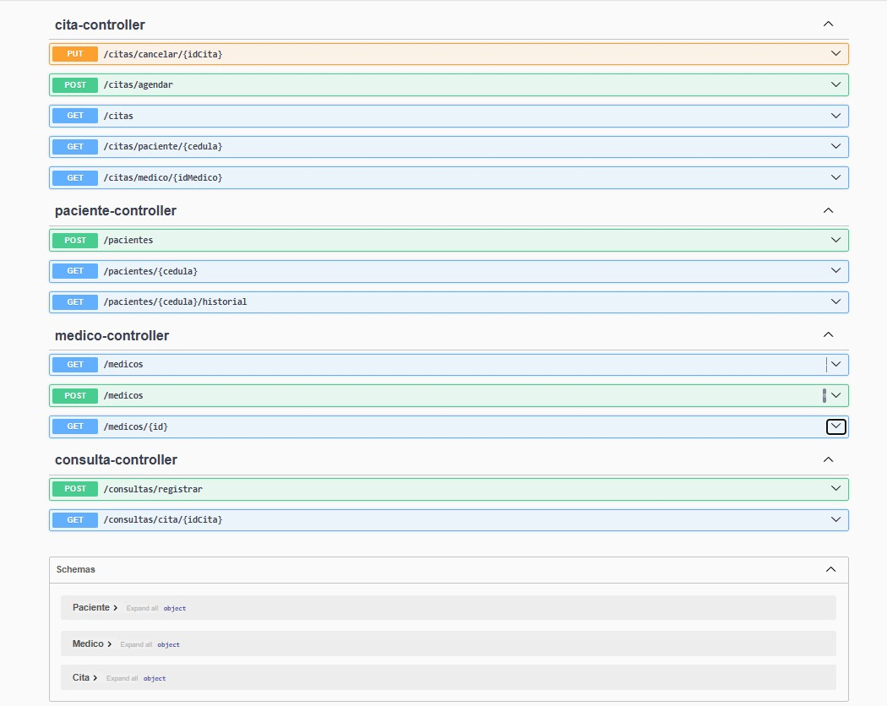
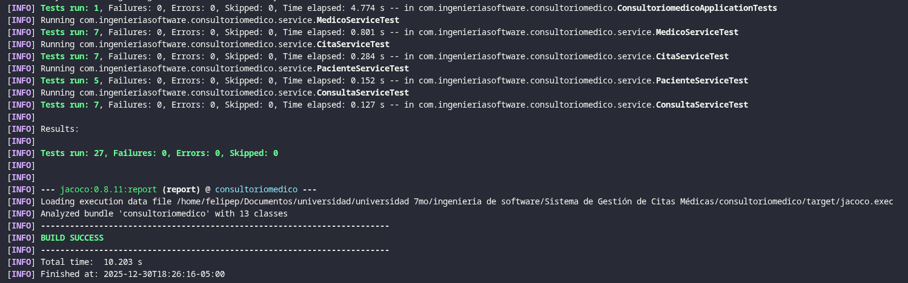
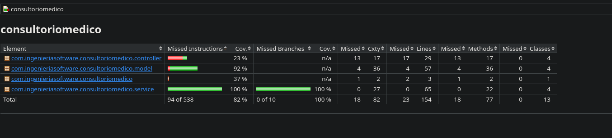

# Sistema de Gestión de Citas Médicas (SGCM)

## Descripción general

El **Sistema de Gestión de Citas Médicas (SGCM)** es una aplicación backend desarrollada en **Spring Boot**, orientada a la gestión de pacientes, médicos y citas médicas dentro de un consultorio.  
El sistema expone servicios REST que permiten registrar pacientes, médicos y agendar citas médicas, siguiendo una arquitectura en capas basada en **Modelo – Repositorio – Servicio – Controlador**.

Este proyecto corresponde a la **Tarea T02.03 – Construcción de Aplicación de Software**, de la carrera de **Ingeniería de Software – Universidad Politécnica Salesiana**.

---

## Alcance del sistema

El sistema **incluye**:

- Registro de pacientes
- Registro y consulta de médicos
- Agendamiento de citas médicas
- Consulta de historial de citas por paciente
- Exposición de servicios REST documentados

El sistema **no incluye**:

- Módulo de facturación
- Gestión de inventarios
- Autenticación y autorización avanzada

---

## Arquitectura

El SGCM está desarrollado bajo una **arquitectura cliente-servidor en capas**, siguiendo el patrón:

Modelo → Repositorio → Servicio → Controlador

### Capas del sistema

- **Modelo (model):** Entidades del dominio (Paciente, Médico, Cita)
- **Repositorio (repository):** Acceso a datos mediante Spring Data JPA
- **Servicio (service):** Lógica de negocio
- **Controlador (controller):** Exposición de endpoints REST
- **Base de Datos:** Configurable mediante JPA (PostgreSQL u otra)

---

## Estructura del proyecto

```text
src/main/java/
└── ec/edu/ups/consultoriomedico/
    ├── controller/
    │   ├── CitaController.java
    │   ├── ConsultaController.java
    │   ├── MedicoController.java
    │   └── PacienteController.java
    │
    ├── service/
    │   ├── CitaService.java
    │   ├── ConsultaService.java
    │   ├── MedicoService.java
    │   └── PacienteService.java
    │
    ├── repository/
    │   ├── CitaRepository.java
    │   ├── ConsultaRepository.java
    │   ├── MedicoRepository.java
    │   └── PacienteRepository.java
    │
    ├── model/
    │   ├── Cita.java
        ├── EstadoCita.java
        ├── Usuario.java
    │   ├── Consulta.java
    │   ├── Medico.java
    │   └── Paciente.java
    │
    └── ConsultorioMedicoApplication.java
```

---

## Endpoints implementados

### Pacientes (`/pacientes`)

- `POST /pacientes`  
  Registrar un nuevo paciente.

- `GET /pacientes/{cedula}`  
  Consultar un paciente por número de cédula.

---

### Médicos (`/medicos`)

- `POST /medicos`  
  Registrar un nuevo médico.

- `GET /medicos`  
  Listar todos los médicos registrados.

- `GET /medicos/{id}`  
  Consultar un médico por su identificador.

---

### Citas (`/citas`)

- `POST /citas/agendar`  
  Agendar una cita médica entre un paciente y un médico.

- `GET /citas`  
  Listar todas las citas registradas en el sistema.

- `GET /citas/medico/{idMedico}`  
  Listar las citas asignadas a un médico específico.

- `GET /citas/paciente/{cedula}`  
  Listar las citas de un paciente por número de cédula.

- `PUT /citas/cancelar/{idCita}`  
  Cancelar una cita médica cambiando su estado a **CANCELADA**.

---

### Consultas médicas (`/consultas`)

- `POST /consultas/registrar`  
  Registrar una consulta médica asociada a una cita existente.  
  *(La cita pasa automáticamente al estado **FINALIZADA**).*

- `GET /consultas/cita/{idCita}`  
  Obtener la consulta médica asociada a una cita específica (historia clínica básica).

---

## Documentación automática (Swagger UI)

- Con la aplicación en ejecución, la documentación interactiva de la API se genera automáticamente y está disponible en:

- URL: <http://localhost:8080/swagger-ui/index.html>

- Desde esta interfaz puedes explorar los endpoints, ver los modelos de datos y probar las operaciones directamente.

- 

---

## Pruebas unitarias

El proyecto incluye un conjunto completo de pruebas unitarias que garantizan la calidad y confiabilidad del código desarrollado, cumpliendo con los estándares de testing de la industria. La implementación de estas pruebas permite verificar el correcto funcionamiento de cada componente de forma aislada, identificar errores tempranamente y mantener la integridad del código durante el proceso de desarrollo.

### Cobertura de código

El análisis de cobertura demuestra un alto nivel de testing en el proyecto:

- **Cobertura total:** 82%
- **Cobertura de servicios:** 100%
- **Total de pruebas:** 27 casos de prueba
- **Estado:** Todas las pruebas ejecutan exitosamente

La capa de servicios alcanza el 100% de cobertura, lo cual es fundamental ya que contiene toda la lógica de negocio crítica del sistema. Este nivel de cobertura supera el umbral mínimo establecido del 60% y garantiza que las funcionalidades principales del sistema están completamente validadas.

### Herramientas de testing utilizadas

El proyecto utiliza un stack de herramientas modernas y ampliamente adoptadas en la industria:

- **JUnit 5 (Jupiter):** Framework principal de pruebas unitarias que proporciona anotaciones, assertions y un motor de ejecución robusto
- **Mockito:** Framework de mocking que permite crear objetos simulados para aislar las dependencias y probar componentes de forma independiente
- **AssertJ:** Biblioteca de assertions fluidas que mejora la legibilidad de las pruebas mediante una API expresiva y descriptiva
- **PowerMock:** Extensión de Mockito para casos de mocking avanzado, incluyendo métodos estáticos y constructores
- **JaCoCo:** Herramienta de análisis de cobertura de código que genera reportes detallados y valida el cumplimiento del umbral mínimo del 60%

### Metodología de testing

Las pruebas implementadas siguen el patrón **AAA (Arrange-Act-Assert)**, organizando cada caso de prueba en tres secciones claramente definidas: preparación del entorno de prueba, ejecución de la acción a probar y verificación de los resultados esperados. Esta estructura facilita la comprensión y mantenimiento de las pruebas.

Cada prueba está diseñada para ser **independiente y determinista**, garantizando que el resultado sea siempre el mismo sin importar el orden de ejecución. Se utilizan mocks para eliminar dependencias externas como bases de datos o servicios web, lo que acelera la ejecución y aumenta la confiabilidad de las pruebas.

### Clases de prueba

El proyecto cuenta con pruebas exhaustivas para cada servicio de la capa de negocio:

- **CitaServiceTest:** 7 pruebas que validan la gestión de citas médicas, incluyendo creación, listado, filtrado por médico y paciente, y cancelación
- **MedicoServiceTest:** 7 pruebas para el registro y consulta de médicos, verificando validaciones de unicidad y manejo de errores
- **PacienteServiceTest:** 5 pruebas sobre la gestión de pacientes, incluyendo registro con validación de cédula única y búsqueda
- **ConsultaServiceTest:** 7 pruebas para el registro de consultas médicas, validando reglas de negocio y cambios de estado

### Ejecución de pruebas

Para ejecutar las pruebas unitarias:

```bash
./mvnw clean test
```

Imagen de la ejecución exitosa de las pruebas:



Para generar el reporte de cobertura:

```bash
./mvnw clean test jacoco:report
```

El reporte HTML se genera en: `target/site/jacoco/index.html`, aquí una imagen del reporte generado:



### Estrategias de testing aplicadas

- **Mocking de dependencias:** Aislamiento de la lógica de negocio mediante Mockito, creando simulaciones de repositorios y servicios dependientes
- **Cobertura de casos edge:** Validación exhaustiva de casos exitosos, escenarios de error, validaciones de negocio y manejo de excepciones
- **Verificación de interacciones:** Confirmación de que los métodos se invocan correctamente, con los parámetros esperados y el número correcto de veces
- **Testing del flujo completo:** Validación desde la entrada de datos hasta la salida esperada, asegurando la integridad del proceso
- **Nomenclatura descriptiva:** Nombres de métodos de prueba que describen claramente el escenario que se está probando, facilitando la comprensión del código

### Beneficios de las pruebas implementadas

La implementación de pruebas unitarias proporciona múltiples beneficios al proyecto: detección temprana de errores, documentación viva del comportamiento esperado del sistema, confianza para realizar refactorizaciones, reducción de costos de mantenimiento y garantía de calidad en el software desarrollado. Las pruebas actúan como una red de seguridad que permite al equipo de desarrollo introducir cambios con la certeza de que no se están rompiendo funcionalidades existentes.

---

## Tecnologías utilizadas

- **Backend:** Spring Boot  
- **Lenguaje:** Java  
- **Persistencia:** Spring Data JPA / Hibernate  
- **Gestión de dependencias:** Maven  
- **Arquitectura:** REST  
- **Control de versiones:** Git y GitHub  

---

## Ejecución del proyecto

1. Clonar el repositorio:

```bash
git clone https://github.com/usuario/sistema-gestion-citas-medicas.git
```

1. Configurar la base de datos en application.properties.
2. Ejecutar la aplicación:

```bash
mvn spring-boot:run
```

---

## Conclusiones

El Sistema de Gestión de Citas Médicas permite aplicar de manera práctica los conceptos de Ingeniería de Software, integrando análisis, diseño y construcción de un backend funcional en Spring Boot.
La arquitectura en capas facilita la mantenibilidad del sistema y permite su futura ampliación con nuevos módulos y un frontend web.
